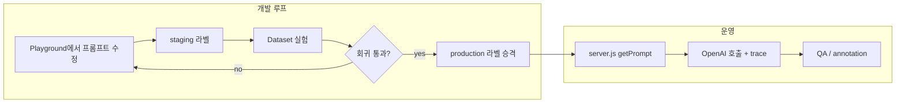

# Langfuse 기반 프롬프트 엔지니어링 개선 계획

작성일: 2026-05-23 (상태 갱신: 2026-05-23 세션)  
관련 문서: `docs/persona-prompt-engineering-improvement-plan.md`, `docs/persona-prompt-engineering-implementation-spec.md`, `docs/prompt-engineering-with-langfuse.md`

## 0. 현재 스냅샷 (2026-05-23)

| 항목 | 상태 |
|------|------|
| **master** | PR #14 (Langfuse 트레이싱·2종 시스템 프롬프트 fetch) + PR #16 (SOLOMON LAB, 500턴, Mobile Training 제거) **머지 완료** |
| **PR #15** `cursor/langfuse-prompt-plan-2994` | 5·6·7번 PE, managed prompts, seed runner, verify — **머지 금지** (Langfuse 실험·참고용) |
| **Langfuse seed (master)** | Cloud Agent VM에서 **완료** — 8개 프롬프트 v1, `production` 라벨 |
| **환경 변수** | `LANGFUSE_PUBLIC_KEY`, `LANGFUSE_SECRET_KEY`, `LANGFUSE_BASE_URL` 주입됨 (`LANGFUSE_HOST` 별칭 지원) |
| **동적 프롬프트** | master: `server.js` 하드코딩 — PR #15에만 Langfuse `chat-dynamic` 등 |
| **Orchestrate** | `CURSOR_API_KEY` 미설정 — kickoff는 로컬 IDE에서 |

**Langfuse에 올라간 프롬프트 (master seed):**

- `roleplay/persona-system`, `roleplay/feedback-system`
- `persona/{id}/runtime-config` × 6

**아직 seed 안 된 것 (PR #15 catalog, 실험 시 수동 seed):**

- `roleplay/chat-dynamic`, `roleplay/chat-initial`, `roleplay/pas-turn-hint`
- `roleplay/feedback-rubric/*` (6 goals)

---

## 1. 요약

이 저장소는 **복음 대화 훈련용 페르소나 롤플레이**를 위해 이미 상당한 프롬프트 엔지니어링(PAS, runtimeCard, 대화 상태 힌트, QA)을 구현했다.  
다음 단계의 병목은 “프롬프트 문장을 더 쓰는 것”보다 **변경·실험·회귀 검증을 제품/엔지니어링 루프로 고정하는 것**이다.

**Langfuse**는 프롬프트 버전 관리, 트레이스 관측, 데이터셋/실험, 실패 분석을 한곳에 모은다.  
**Orchestrate**(`/orchestrate`)는 그 통합 작업을 병렬 Cloud Agent로 나누어 실행한다.

필수 시크릿:

```bash
# Langfuse (UI → Settings → API Keys) — Render + Cursor Cloud Agent Secrets
export LANGFUSE_PUBLIC_KEY=pk-lf-...
export LANGFUSE_SECRET_KEY=sk-lf-...
export LANGFUSE_HOST=https://cloud.langfuse.com   # 또는 LANGFUSE_BASE_URL (동일)

# Orchestrate kickoff (Cursor Dashboard → Integrations) — 로컬 IDE만
export CURSOR_API_KEY=...
```

---

## 2. 현재 상황 분석

### 2.1 이미 잘 갖춰진 부분

| 영역 | 현재 상태 |
|------|-----------|
| 시스템 프롬프트 | `prompts/persona-system-prompt.md`, `prompts/feedback-prompt.md` (파일 기반) |
| 페르소나 데이터 | `data/personas.json` — 6명 모두 `coreStack`, `pasMap`, `badResponsePatterns`, few-shot 등 |
| 런타임 조립 | `server.js` — `staticRoleplayPromptFor`, `chatDynamicPromptFor`, `conversationStateHints`, `formatPasExecutionPlan`, `roleplayPromptPartsFor` |
| 피드백 분리 | 역할 연기 vs 전도 훈련 피드백 프롬프트 분리 유지 |
| QA | `scripts/qa-interactive-roleplay.mjs` 등 — 정량 점수·플래그 (pas-leak, 반복 등) |
| 기획/스펙 | `persona-prompt-engineering-improvement-plan.md`, `implementation-spec.md` |

최근 interactive QA(2026-05-16)는 일부 케이스에서 100점 pass이나, **전체 24케이스·장기 회귀·프롬프트 변경 추적**은 아직 “파일 diff + 수동 QA 실행”에 의존한다.

### 2.2 구조적 한계 (Langfuse가 해결할 문제)

1. **정적 프롬프트는 해소됨, 동적 블록은 아직 코드 결합** — `persona-system`/`feedback-system`은 Langfuse fetch 가능. `chatDynamicPromptFor`, `guardrailPrompt` 등은 master에서 여전히 `server.js` 재배포 필요.
2. **실험 재현성 부족** — trace에 prompt version은 붙지만, QA 24케이스와 Langfuse Dataset/Experiment는 아직 미연동.
3. **동적 블록은 trace metadata로만 부분 가시** — `dynamicInputChars`, `instructionsPreview`는 trace에 있으나 Playground에서 전체 조립 미리보기는 PR #15 수준 필요.
4. **평가 루프가 분산** — QA JSON/MD는 `docs/qa-runs/`에 쌓이지만 Langfuse scorer/annotation queue와 연결되지 않음.
5. **PR #15와 master 분리** — PE 개선안(5·6·7)은 브랜치에만 있고 prod 코드에 merge하지 않기로 함 → Langfuse UI에서 staging 실험 후 선택적 채택.

### 2.3 프롬프트 인벤토리 (마이그레이션 대상)

Langfuse Prompt Management 기준으로 나눈다. **정적 텍스트**는 UI/SDK로 버전 관리하고, **동적 조립**은 코드에 두되 trace metadata로 연결한다.

| Langfuse 이름 (제안) | 유형 | 소스 | 변수 (`{{...}}`) |
|---------------------|------|------|------------------|
| `roleplay/persona-system` | text | `prompts/persona-system-prompt.md` | 없음 |
| `roleplay/feedback-system` | text | `prompts/feedback-prompt.md` | 없음 |
| `roleplay/guardrails` | text | `server.js` `guardrailPrompt` | 없음 |
| `roleplay/static-session-shell` | text | `staticRoleplayPromptFor` 고정 문단 | `personaName`, `relationship`, `setting`, `goal` 등 |
| `roleplay/chat-dynamic-shell` | text | `chatDynamicPromptFor` 고정 지침 블록 | `phase`, `settingHint`, `questionVariety` |
| `roleplay/initial-dynamic-shell` | text | `initialDynamicPromptFor` | `goalPressure` |
| `_sub/runtime-card-format` | text (subprompt) | `formatRuntimeCard` 출력 **템플릿** | `runtimeCardJson` (코드에서 JSON 직렬화) |
| `_sub/pas-execution-plan` | text | `formatPasExecutionPlan` **템플릿** | `selectedPas`, `userMove` |

**코드에 남길 것 (Langfuse `{{var}}`만으로 불가):**

- `conversationStateHints`, `conversationMemoryFor` — 휴리스틱/키워드 기반
- `formatPasExecutionPlan`의 trigger 매칭
- `data/personas.json` 전체 (페르소나별 데이터는 DB/JSON 유지, trace에 `personaId` 태그)

**Config로 Langfuse에 올릴 것 (prompt `config` JSON):**

```json
{
  "modelType": "chat",
  "reasoningEffort": "high",
  "maxOutputTokens": 3200
}
```

피드백 호출용 별도 config (`modelType: feedback`, `reasoningEffort: medium`).

---

## 3. Langfuse로 프롬프트 엔지니어링을 개선하는 방법

### 3.1 목표 워크플로



### 3.2 단계별 구현

#### Phase 0 — 관측만 (가장 낮은 리스크)

**목표:** 배포 없이 “무엇이 모델에 들어갔는지”를 본다.

1. `@langfuse/client`, `@langfuse/otel`, `@langfuse/openai`(또는 수동 span) 추가
2. `callModelWithUsage` / `roleplayPromptPartsFor` 경로에 trace:
   - `sessionId`, `personaId`, `relationship`, `setting`, `goal`
   - `staticSystemBlocks`, `dynamicInput` (또는 해시+길이)
   - `instructions` 프롬프트 이름·버전 (`langfuse_prompt`)
3. `.env.example`에 `LANGFUSE_*` 문서화

**성공 기준:** Langfuse Traces에서 generation 클릭 시 입력 전문·토큰·모델 확인 가능.

#### Phase 1 — 정적 프롬프트 외부화

**목표:** `persona-system`, `feedback-system`, `guardrails`를 Langfuse `production`에서 fetch.

1. CLI/SDK로 초기 업로드 (`labels: ["production"]`)
2. `server.js` 시작 시 캐시된 `langfuse.prompt.get(..., { label: "production" })`
3. 로컬/CI fallback: 파일 읽기 (Langfuse 장애 시)

```javascript
// 패턴 (문서 기준 — 구현 시 최신 SDK 문서 재확인)
const personaPrompt = await getManagedPrompt("roleplay/persona-system", fallbackPath);
```

**성공 기준:** UI에서 시스템 프롬프트 문장 수정 → 재배포 없이(캐시 TTL 내) 반영.

#### Phase 2 — 동적 셸 + 링크

**목표:** 조립 구조는 코드, 문구는 Langfuse.

1. `chat-dynamic-shell` 등에 고정 지침 이전
2. Generation에 `prompt` 객체 연결 → 버전 diff로 “무엇이 바뀌어 실패했는지” 추적
3. Playground에서 `{{phase}}` 등 샘플 값으로 미리보기

#### Phase 3 — 평가·실험

**목표:** QA 스크립트 결과를 Langfuse Dataset/Experiment와 동기화.

1. **Dataset:** `qa-interactive-roleplay` 케이스 24개를 dataset item으로 import (입력: 세션 설정 + 사용자 시나리오, 기대: 체크리스트 ID)
2. **LLM-as-judge 또는 rule-based scorer:**
   - repetition, barrier_retention, pas_leak (기존 QA 로직 재사용)
3. **Experiments:** `staging` vs `production` 프롬프트 라벨 비교
4. **Annotation queue** (error-analysis 가이드): 실패 trace 50건 open coding → `pass_fail`, `failure_mode`

**성공 기준:** 프롬프트 PR마다 Experiment 리포트 링크를 PR 설명에 첨부.

#### Phase 4 — 운영 피드백 (선택)

- 세션 종료 후 thumbs → Langfuse score on trace
- `docs/persona-prompt-engineering-improvement-plan.md` 10절 원칙 유지: **사용자 피드백 UI에는 시뮬레이션 품질 노출 금지**, 내부 trace/score만

### 3.3 라벨 전략

| 라벨 | 용도 |
|------|------|
| `production` | Render/운영 서버 |
| `staging` | 실험·PR preview |
| `latest` | 자동 최신 (운영 fetch 금지) |

페르소나 데이터(`personas.json`)는 당분간 Git 버전 관리. trace metadata에 `personasGitSha`를 넣어 실험 재현.

### 3.4 기존 QA와의 관계

| 기존 | Langfuse 이후 |
|------|----------------|
| `npm run qa:*` 로컬 실행 | CI에서 동일 실행 + 결과를 experiment run으로 업로드 (선택) |
| `docs/qa-runs/*.md` | 사람 읽기용 요약 유지; canonical 메트릭은 Langfuse |
| 정량 rubric (반복 2회 이하 등) | Dataset run scorer로 자동화 |

---

## 4. Orchestrate로 실행하는 방법

Dispatcher는 **코딩하지 않고** root planner만 spawn한다. 아래 goal을 **그대로** kickoff에 넘긴다.

### 4.1 Kickoff (로컬 IDE에서 실행)

```bash
cd /path/to/cursor/plugins/.../skills/orchestrate/scripts
bun install   # 최초 1회

export CURSOR_API_KEY=...   # user key

bun cli.ts kickoff "Langfuse 통합으로 복음 대화 훈련소 프롬프트 엔지니어링 루프 구축: Phase 0 관측, Phase 1 정적 프롬프트 마이그레이션, QA-Langfuse 실험 연동. docs/langfuse-prompt-engineering-orchestration-plan.md 준수." \
  --ref master
```

출력 JSON의 `url`로 root planner 진행 상황을 본다.

### 4.2 권장 작업 분해 (planner가 publish할 task 예시)

| Task | 담당 | 산출물 |
|------|------|--------|
| T1 | Worker | `@langfuse/*` 의존성, `.env.example`, `getManagedPrompt` 헬퍼 |
| T2 | Worker | `callModelWithUsage` trace + metadata (`personaId`, prompt version) |
| T3 | Worker | Langfuse에 `roleplay/*` 프롬프트 초기 업로드 스크립트 |
| T4 | Worker | `persona-system` / `feedback-system` fetch + file fallback |
| T5 | Subplanner | Dataset import + experiment runner (`scripts/langfuse-qa-experiment.mjs`) |
| T6 | Verifier | `npm run check`, smoke, 2케이스 interactive QA, trace에 prompt 링크 확인 |

**충돌 방지:** T1–T4는 `server.js` + `package.json`; T5는 `scripts/`; planner가 handoff로 순서 고정.

### 4.3 Verifier 수락 기준

- [ ] Langfuse trace 1건 이상에 generation + linked prompt (Phase 1 이후)
- [ ] Langfuse 미설정 시 앱이 기존처럼 파일 fallback으로 기동
- [ ] `qa-interactive-roleplay` 2케이스 이상 pass, pas-leak 0
- [ ] 문서: README 또는 `docs/deployment-guide.md`에 `LANGFUSE_*` 설정 절 추가

---

## 5. 우선순위 (권장 순서)

1. **Phase 0** — 관측 (가치 대비 리스크 최소, 디버깅 즉시 개선)
2. **Phase 3 일부** — 기존 QA 점수를 Langfuse scorer로 복제 (프롬프트 UI 변경 전에 baseline)
3. **Phase 1** — 정적 3종 마이그레이션
4. **Phase 2** — 동적 셸
5. **Phase 4** — 사용자 score (필요 시)

프롬프트 **내용** 개선(PAS 예시 추가 등)은 Langfuse Playground + Dataset experiment가 붙은 **이후**에 iteration한다. 그렇지 않으면 “더 좋은 문장”인지 “측정 가능한 개선”인지 구분이 어렵다.

---

## 6. 리스크와 완화

| 리스크 | 완화 |
|--------|------|
| Langfuse 장애 | 파일 fallback + SDK 클라이언트 캐시 |
| 프롬프트 과대 — 토큰 증가 | `formatRuntimeCard` 제한 유지; trace에서 input 토큰 모니터링 |
| `{{var}}` 미지원 로직 | 조건/루프는 코드에서 전처리 (skill: prompt-migration) |
| 비밀키 노출 | 키는 채팅/PR에 붙이지 않음; Render env만 |
| Orchestrate와 server.js 충돌 | planner가 파일 소유권을 task별로 분리 |

---

## 7. 다음 액션 (우선순위)

### 즉시 (운영·PE 루프 시작)

1. **Render** — `LANGFUSE_*` 3종 + `LANGFUSE_PROMPT_LABEL=production` 확인 (이미 render.yaml에 정의됨)
2. **Langfuse UI** — Prompts에서 seed된 8개 v1 확인; trace 1건 생성 후 generation에 prompt version 링크 확인
3. **일상 PE** — `docs/prompt-engineering-with-langfuse.md` 루프: Playground → `staging` → Render `LANGFUSE_PROMPT_LABEL=staging` → trace 검토 → `production` 승격

### 단기 (코드 merge 없이)

4. PR #15 브랜치에서 **추가 seed만** 실행 (managed catalog 11종 + persona config) — prod `server.js`는 master 유지
5. PR #15의 `prompts/langfuse/*.md`를 Langfuse Playground에 복사해 **staging 실험** (앱 동작 변경 없음)

### 중기 (Orchestrate 또는 단일 PR)

6. **Phase 3** — QA 24케이스 → Langfuse Dataset import + experiment runner (`scripts/langfuse-qa-experiment.mjs`)
7. **Phase 2 선택적 채택** — PR #15에서 `managed-prompts` + fetch만 cherry-pick (프롬프트 문구 diff는 Langfuse UI에서 관리)
8. `.github/workflows/langfuse-seed.yml` — master에 workflow만 cherry-pick (키는 GitHub Secrets)

### Orchestrate kickoff (로컬 IDE)

```bash
# cursor-sdk skill 참고 — CURSOR_API_KEY 필요
/orchestrate Langfuse PE: master 유지, PR15 merge 금지. Dataset+experiment(T5), trace 검증(T6), staging PE 가이드 문서화.
```

이 문서는 **계획**이다. PR #15 전체 merge는 사용자 명시로 금지; Phase별·cherry-pick으로 진행한다.
