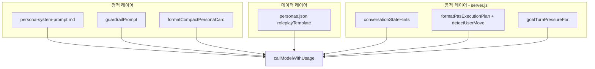

# Persona Gospel 페르소나 분석 × Langfuse × Orchestrate

작성일: 2026-05-23  
데이터 소스: `data/personas.json`, `server.js`, `prompts/`

## 1. 이 앱에서 “페르소나”란 무엇인가

Persona Gospel(복음 대화 훈련소)의 페르소나는 **캐릭터 챗봇**이 아니라 **복음 전도 연습 상대역**이다.

- 사용자: 기독교 신자, 복음 대화 훈련 중 (대화 안에서는 드러내지 않음)
- 페르소나: 비신자/회의자/상처자 등, **자기 고민·복음 장벽** 중심으로 반응
- 코치 역할: `prompts/feedback-prompt.md` (세션 종료 후 전도 품질 피드백만)

실행 시 3층 구조:



Langfuse는 **정적 문장 버전 관리**와 **매 턴 실제 입력·페르소나 메타데이터 트레이스**를 연결한다.

---

## 2. 6명 페르소나 카탈로그

| ID | 이름 | 한 줄 정체성 | PAS 수 | 핵심 장벽 (lateSession) |
|----|------|-------------|--------|-------------------------|
| `kim-sihyun` | 김시현 | 인정·안정 욕구 취준생 | 8 | 하나님 사랑이 취업 불안·비교에 실제로 닿는 감각 없음 |
| `park-doyoon` | 박도윤 | 근거·논리 회의주의 이과형 | 8 | 믿음이 근거 위 신뢰인지, 생각을 멈추는 것이 아닌지 |
| `jung-haeun` | 정하은 | 교회 상처 방어형 | 8 | 예수님 vs 교회 사람 실패 구분은 들으나 재신뢰 두려움 |
| `choi-minjae` | 최민재 | 성과·자기관리 현실주의 | 8 | “성과가 전부 아님”이 일·기준에 어떻게 바뀌는지 모름 |
| `oh-yujin` | 오유진 | 사랑 갈망·감정형 | 8 | 하나님 사랑은 듣고 싶으나 죄 이야기가 판단받는 느낌 |
| `han-seojun` | 한서준 | 온건 도덕주의 | 8 | 은혜는 조금 이해도 “착하게 산 삶≠구원 근거”가 불편 |

공통 `roleplayTemplate` 필드:

- `coreStack`: coreTrait / modifier / humanFlaw (캐릭터 압축)
- `pasMap` 8개: `userMove`별 Purpose–Action–pressure–avoid–example
- `gospelReactionMap`: godLove, sin, cross, faith 등 복음 요소별 장벽
- `badResponsePatterns`, `imperfectionPattern`, `fewShotResponses`
- `lateSessionTension`: 한 세션 안에서 **해결하지 말 것**

기계 판독용 카탈로그: `data/langfuse-persona-catalog.json` (`npm run langfuse:catalog`)

---

## 3. PAS(userMove) 공통 프레임

각 페르소나 `pasMap`은 동일한 8개 `userMove` 슬롯을 공유한다.

| userMove | 트리거 의미 |
|----------|------------|
| `smalltalk` | 일상·근황 |
| `listening` | 경청·공감 (fallback) |
| `empathy` | 공감 표현 |
| `pressure` | 빠른 믿음·결론 압박 |
| `god_love` | 하나님 사랑 |
| `sin_repentance` | 죄·회개 |
| `cross_resurrection` | 십자가·부활 |
| `faith_salvation` | 믿음·구원 |
| `closing` | 후반 마무리 |

`server.js`의 `detectUserMove()`가 마지막 사용자 발화를 분류하고, `selectPasEntries()`가 해당 `userMove`의 PAS 후보 최대 3개를 `formatPasExecutionPlan()`에 넣는다.  
**같은 userMove라도 페르소나별 example·pressure 문구가 다르다** — 이것이 6명 차별의 핵심이다.

---

## 4. Langfuse에 매핑하는 방법

### 4.1 Trace (구현됨 — Phase 0)

`lib/langfuse-tracing.js` + `callModelWithUsage({ traceContext })`

환경 변수가 있을 때만 활성화:

- `LANGFUSE_PUBLIC_KEY`, `LANGFUSE_SECRET_KEY`, `LANGFUSE_HOST` (또는 `LANGFUSE_BASE_URL`)

각 chat/feedback generation에 기록:

| 필드 | 내용 |
|------|------|
| `sessionId` | `conversationId` |
| `userId` | 훈련 사용자 |
| `tags` | `persona:{id}`, `goal`, `relationship`, `setting`, `user_move:{move}` |
| `metadata` | personaName, coreTrait, selectedPasId, turnCount, 입력 길이 |
| `input` | dynamicInput, userMessage (미리보기) |

Langfuse UI에서 **“김시현 + god_love + 반복 실패”**처럼 필터링 가능.

### 4.2 Prompt Management (시드 스크립트)

```bash
npm run langfuse:seed          # Langfuse에 업로드
npm run langfuse:seed -- --dry-run
```

생성되는 프롬프트:

| 이름 | 내용 |
|------|------|
| `roleplay/persona-system` | `prompts/persona-system-prompt.md` |
| `roleplay/feedback-system` | `prompts/feedback-prompt.md` |
| `persona/{id}/runtime-config` | JSON config (필터·실험용, 실행 텍스트 아님) |

`personas.json` 본문은 계속 Git에서 관리. Langfuse config에 `personaId`, `userMoves`, `gospelBarriers` 요약만 올린다.

### 4.3 Dataset / Experiment (다음 단계)

1. `data/langfuse-persona-catalog.json` + `scripts/qa-interactive-roleplay.mjs` 케이스 → Langfuse Dataset
2. Scorer: repetition, barrier_retention, pas_leak (기존 QA 로직 재사용)
3. `staging` vs `production` 프롬프트 라벨 비교 후 승격

---

## 5. Orchestrate 실행 계획

로컬 IDE에서 **dispatcher**가 kickoff (Cloud Agent VM에는 `CURSOR_API_KEY` 없음):

```bash
cd ~/.cursor/plugins/cache/cursor-public/9333/3347cbab5b54136f6fba0994c3a01a56f7fb7fca/skills/orchestrate/scripts
bun install
export CURSOR_API_KEY=...

bun cli.ts kickoff "Persona Gospel: docs/persona-langfuse-analysis.md 기준 Langfuse Phase 0-3. 페르소나 6명 QA dataset, trace 검증, prompt seed. server.js Langfuse 통합 유지." --ref master
```

| Task | 범위 |
|------|------|
| W1 | trace metadata 검증, Render env 문서 |
| W2 | `langfuse:seed` CI/문서, Playground에서 persona-system A/B |
| W3 | QA 24케이스 → Langfuse dataset + experiment runner |
| V1 | verifier: trace 1건, QA 2케이스 pass, 키 없을 때 fallback |

---

## 6. 페르소나별 Langfuse 실험 우선순위

품질 리스크가 큰 조합부터 dataset에 넣는 것을 권장한다.

1. **김시현** × 경청 × `god_love` — “좋은 말이지만 불안에 안 닿음” 유지 여부
2. **정하은** × 간증 × 교회 상처 — 변호·가벼운 위로 금지
3. **박도윤** × 압박 × `cross_resurrection` — 근거 요구·방어
4. **한서준** × `faith_salvation` — 선행 vs 은혜 혼동 방지
5. **최민재** × 성과 언어 — 자기계발식 위로 금지
6. **오유진** × 죄·십자가 — 정죄 없이 연결

---

## 7. 관련 파일

| 파일 | 역할 |
|------|------|
| `lib/langfuse-tracing.js` | OTel + Langfuse span, persona trace context |
| `scripts/langfuse-seed-prompts.mjs` | 프롬프트·config 업로드 |
| `scripts/export-persona-langfuse-catalog.mjs` | 카탈로그 JSON 생성 |
| `data/langfuse-persona-catalog.json` | 6명 메타 (생성물) |
| `docs/langfuse-prompt-engineering-orchestration-plan.md` | 전체 로드맵 |
